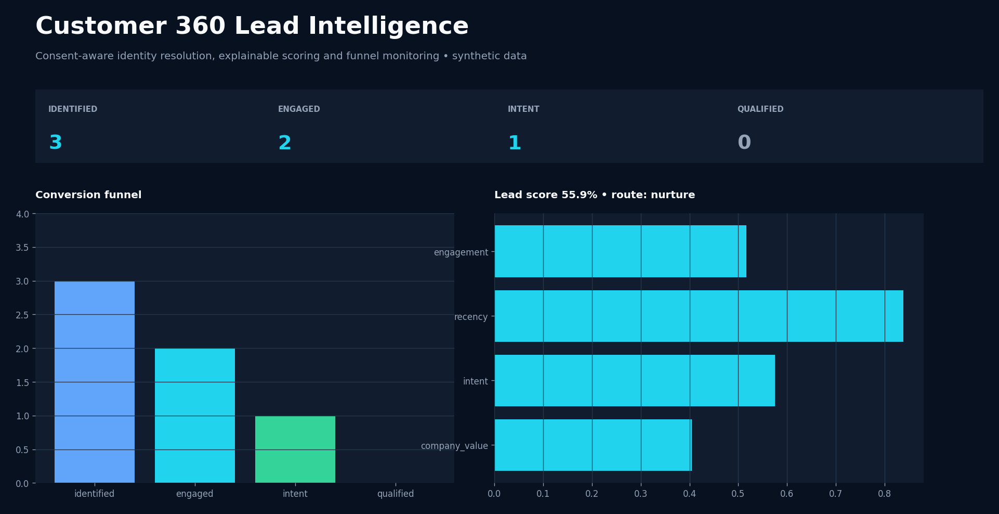
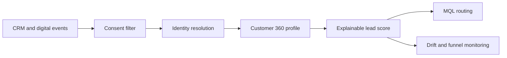

# Customer 360 Lead Intelligence

[](https://github.com/Lonfea/customer-360-lead-intelligence/actions/workflows/ci.yml)


A privacy-aware reference implementation for customer identity resolution, explainable lead scoring, routing, funnel analytics and model-drift monitoring.

> Independent portfolio project using synthetic events. No real customer information is included and the project is not affiliated with Infineon.

## Dashboard preview



## Business problem

Marketing, sales and CRM systems frequently contain duplicate identities, incomplete attributes and inconsistent events. This service creates deterministic customer profiles, scores purchase intent, routes qualified leads and exposes the evidence behind every decision.

## Capabilities

- Email/phone normalization and deterministic identity graph
- Consent-aware feature calculation
- Time-decayed behavioral features
- Explainable logistic lead score with contribution breakdown
- Configurable MQL threshold and regional routing
- Funnel conversion and speed-to-lead KPIs
- Population Stability Index for production drift monitoring
- API, dashboard, tests, Docker and CI



## Run

```bash
python -m venv .venv && source .venv/bin/activate
pip install -e '.[dev]'
pytest
uvicorn lead_intel.api:app --reload
streamlit run src/lead_intel/dashboard.py
```

See [privacy and model governance](docs/governance.md).
